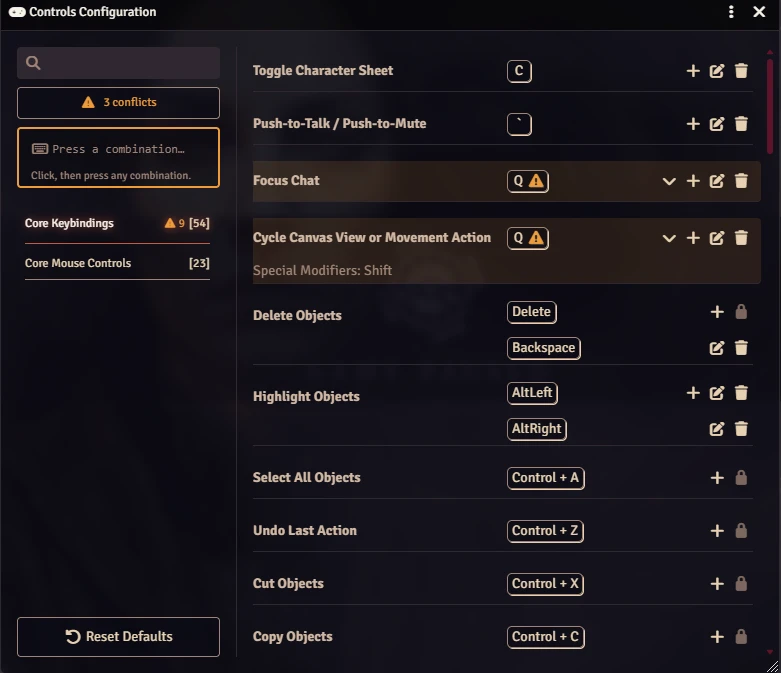
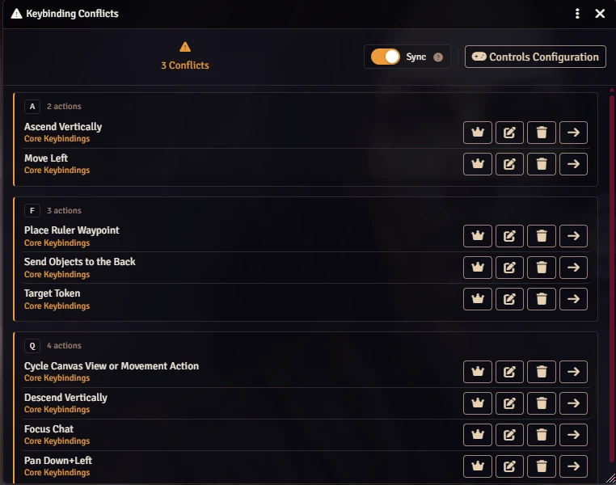
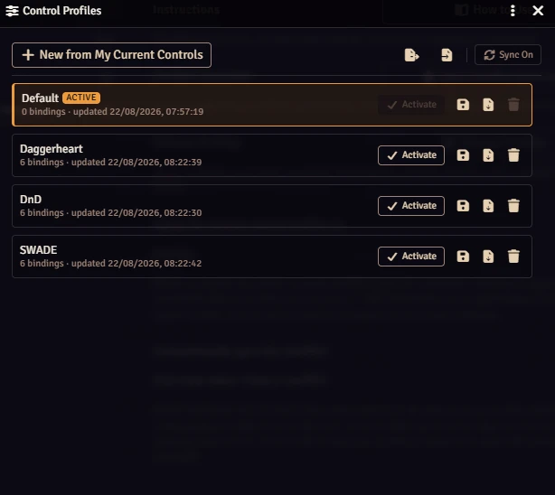

# Undumbify Shortcuts

> **Stop guessing which module stole your hotkey.** Foundry tells you a keybinding conflicts. Undumbify Shortcuts tells you *with what*, *from which module*, and lets you fix it on the spot.

[](https://buymeacoffee.com/mestredigital) [](https://mestredigital.online/pages/projetos-en)

Se você quiser ler em português do Brasil, [clique aqui](docs/README-ptbr.md).

---

## What is Undumbify Shortcuts?

Foundry's **Controls Configuration** window marks a conflicting keybinding with a ⚠ and a tooltip like *"Potentially conflicts with Copy"*. That tooltip names an action — but not the module it came from. With thirty modules installed, "Copy" could be any of them, and tracking the real culprit means opening every category and reading every row by hand.

Undumbify Shortcuts fills in the missing half. Every conflict tells you the **action and the package behind it**, and every conflict can be resolved from the row you are already looking at.

---

## ✨ Features

- **Name the culprit** — expand any conflicting binding to see every other action on that combination, each labelled with the module, system, or core that registered it.
- **Rebind in place** — change a conflicting binding directly inside the expansion panel. No hunting through categories, no losing your place.
- **Live verdict while typing** — press a candidate combination and get an immediate answer: free, or already taken by a named list of actions and packages.
- **Search by combination** — click the sidebar field and press any combination. Every action bound to it is listed, matching rows are highlighted, and the rest are dimmed.
- **Jump to any action** — one click switches to the right category, scrolls to the action, and flashes it.
- **Per-category conflict counts** — the sidebar nav shows how many actions in each category need attention, and a running total opens the full resolver.
- **Conflict Overview & resolver** — a standalone window listing every contested combination, who is competing for it, and a **"Keep this one"** button that clears every other claim in a single confirmed step. Opens automatically for anyone whose client starts the world already with a conflict — GM or player alike — with a per-client setting to turn that off.
- **Live sync, on by default** — while enabled, every connected client mirrors whichever bindings the GM has explicitly customized, automatically, on every edit — actions only a player has customized are left alone, so nothing is silently overwritten.
- **Control profiles** — save named keybinding sets to the module's own persistent storage, so enabling the module in *any* world can bring your controls with it. Activating one applies it immediately, and reaches every connected user too if Sync is on.
- **Native look** — built entirely on Foundry's own design tokens, so it follows your chosen theme instead of fighting it.

---

## 🛠️ How to Use

### Inside Controls Configuration

1. Open **Game Settings** → **Configure Controls**.
2. Any binding sharing a combination gets an extra button in its row. Click it.
3. The panel below names every competing action and the package it belongs to.
4. From that panel:

   | Button | What it does |
   |---|---|
   | **→** | Switches to that action's category and scrolls to it |
   | **✎** | Rebinds it right there — press a new combination, then save |
   | **🗑** | Removes the binding, leaving the action unassigned |
   | **🔒** | Shown instead when the package locked that binding |

5. To hunt a specific combination, click the **"Press a combination…"** field in the sidebar and press it. Press `Esc` to clear.



### The Conflict Overview

Click the badge under the sidebar search field (or the window's header control) to open the **Conflict Overview** — every contested combination as its own group, with **Keep this one**, **Rebind**, **Clear**, and **Go to it** for each claim. Its toolbar carries a **Sync** switch (on by default): while on, every action the GM customizes — here or anywhere else — mirrors onto every connected client automatically, with no button to click. A GM sees it as a toggle; everyone else sees a read-only status. It is also reachable from **Game Settings** → **Module Settings** → **Undumbify Shortcuts**.



### Control Profiles

**Game Settings** → **Module Settings** → **Undumbify Shortcuts** → **Manage Profiles** (GM only) saves complete keybinding sets into the module's own folder, so they travel with the module between worlds. Activating a profile applies it to you immediately (and, if Sync is on, to everyone connected right now), and every client that opts in (on by default, per client) picks it up automatically the next time they connect — enabling the module is enough to bring the shared controls along.



---

## ⚠️ What Counts as a Conflict?

Two or more keybindings registered through `game.keybindings.register()` using the **exact same key plus modifiers**. Both editable and package-locked bindings are counted.

> **A shared combination is not automatically a bug.** Keybindings only fire in the context they were registered for — on the canvas, inside a text editor, during combat. Two actions can share a combination and never actually collide. The module says so in the window itself, and the note can be dismissed for good.

> Foundry's own *"Potentially conflicts with Copy"* warning also covers browser shortcuts such as `Ctrl+C`. That is a separate system; this module reports Foundry-to-Foundry collisions only.

---

## 📦 Installation

1. Open Foundry VTT and go to **Add-on Modules**.
2. Click **Install Module**.
3. Paste the following manifest URL in the **Manifest URL** field at the bottom:

```
https://raw.githubusercontent.com/brunocalado/undumbify-shortcuts/main/module.json
```

4. Click **Install** and then enable the module in your world.

---

## 🐛 Bug Reports & Feature Requests

Found a bug or have an idea for a new feature? Open an issue on GitHub:

👉 https://github.com/brunocalado/undumbify-shortcuts/issues

---

## Credits and License

This module is released under the [GNU General Public License v3](LICENSE).

This module is a fork of [controls-config-conflict-resolver](https://github.com/jacksands/controls-config-conflict-resolver) by Jack Sands. Thank you for the original work that made this possible.

- [donkey](https://publicdomainvectors.org/en/free-clipart/Outlined-donkey-toy/82208.html)